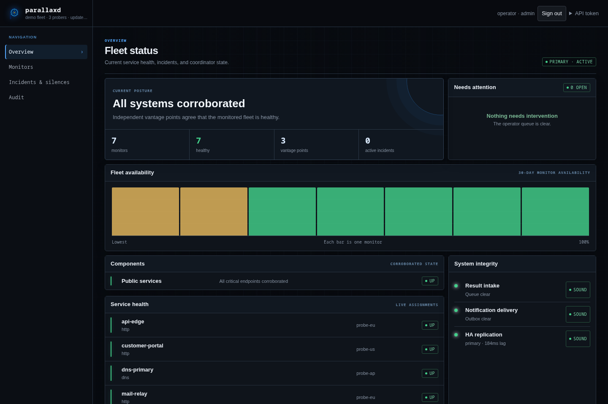

# parallaxd

Corroborated availability monitoring: check from one place, confirm from
several, and alert only when they agree.

Parallax is the apparent shift of an object viewed from two separated points.
That is the idea here: one viewpoint cannot distinguish a service outage from
its own broken path, but several independent viewpoints can.

> **Status: operational.** The coordinator, public and private probers,
> external watcher, warm standby, dashboard, and durable alert lifecycle are
> implemented. See the [roadmap](ROADMAP.md) for current work.



## How it works

One prober runs each check on its normal schedule. When it reports a failure,
the coordinator asks other probers to test the same target immediately and
applies a quorum rule to their signed results.

```text
scheduled probe reports down
        │
        ▼
coordinator requests corroboration
        │
        ▼
quorum agrees ── yes ──► alert once on the transition
        │
        no
        ▼
remain inconclusive and retain the suspect timeline
```

This keeps steady-state traffic low while still checking failures from
independent providers. It also supports richer checks—such as TLS, SMTP, DNS,
gRPC, NTP, and authenticated HTTP—without running every check from every host
all the time.

The design relies on a few rules:

- Results are `up`, `down`, or `unknown`; `unknown` never counts as a vote.
- Every check declares a `public` or `internal` vantage.
- Each prober votes once, and optional provider diversity prevents several
  hosts at one provider from masquerading as independent evidence.
- A prober that cannot reach any of at least two peers is treated as isolated,
  and its target results are suppressed until it rejoins.
- Alerts fire on state transitions, not on every result. An inconclusive result
  does not clear an active outage.
- Requests and results are signed with Ed25519. The control plane should still
  use WireGuard or another encrypted transport because signatures do not
  provide confidentiality.

## Components

| Binary | Role |
|---|---|
| `parallaxd` | Assigns checks, evaluates quorum, persists state, and sends alerts |
| `parallaxd-probe` | Runs scheduled and on-demand checks; makes no decisions |
| `parallaxd-watch` | Alerts when the coordinator's signed heartbeat stops |
| `parallaxd-ha` | Preflights and explicitly promotes a fenced warm standby |
| `parallaxd-network` | Creates and installs the WireGuard control overlay |

The coordinator also serves an operator dashboard, authenticated monitor and
incident APIs, a redacted public status export, observation history, and HA
diagnostics. Alert delivery supports the always-on log, durable generic
webhooks, and native Tintwire cards with a generic-webhook fallback (for
example, Mattermost) when Tintwire has a retryable delivery failure.

Supported checks are `tcp`, `http`, `banner`, `dns`, `tls`, `smtp`, `icmp`,
`request`, `grpc`, and `ntp`. Related checks can be grouped into components so
operators receive one service-level alert instead of one alert per port.

## Deployment

### Try it on one machine

The Docker Compose demo brings up a coordinator, three probers, a watcher, and
a controllable HTTP target on one machine:

```sh
docker compose up --build --wait
```

Open `http://127.0.0.1:8972` and follow the
[`demo` exercise](demo/README.md). The demo uses public, deliberately insecure
keys and credentials. Its provider labels are illustrative: containers on one
host are not independent failure domains, so Compose is for evaluation only
and must not be used as a production deployment.

A meaningful deployment needs one dedicated coordinator and at least three
probers in distinct failure domains. The minimal topology below shares the
watcher with one prober and omits the optional standby. Add HA only after this
topology works; four probers then provide a spare.

### Prerequisites

The Ansible controller needs Linux, Ansible, the Go version declared in
[`go.mod`](go.mod), `ansible.posix`, and SSH access with privilege escalation
to every target. Targets need a systemd-based Linux distribution with a
supported package manager. By default, the playbook installs and manages
firewalld. Ensure the hosts can reach each other at the addresses in the
inventory; TCP ports 8972–8974 carry the control traffic.

Ed25519 signs that traffic but does not encrypt it. Use private networking or
another encrypted transport for production. The project-managed WireGuard
overlay is configured when a standby is enabled and can also carry
internal-prober traffic.

### Minimal installation

Run these commands from the `ansible` directory:

```sh
git clone https://github.com/kilo666mj/parallaxd.git
cd parallaxd/ansible
ansible-galaxy collection install -r requirements.yml
cp inventory.example inventory
cp group_vars/all.yml.example group_vars/all.yml
# Edit inventory and replace the bootstrap password in group_vars/all.yml
# (one way to generate it is: openssl rand -base64 32).
ansible-inventory --graph
ansible all -m ping
ansible-playbook playbook.yml --syntax-check
ansible-playbook playbook.yml --check --diff
ansible-playbook playbook.yml
```

The example intentionally starts with no standby, no internal probers, no
custom CA, and no remote alert destination. Alerts are still recorded locally.
Before using the deployment in production, configure a watcher destination and
protect `group_vars/all.yml` with Ansible Vault or your normal secret manager.

Start with the documented variables in
[`ansible/group_vars/parallaxd.yml`](ansible/group_vars/parallaxd.yml). The
playbook generates signing keys on their owning hosts, validates rendered
configuration, installs systemd services, configures the project WireGuard
overlay where needed, and applies source-restricted firewall rules.

The inventory has these groups:

- `parallaxd_coordinator`: exactly one host, separate from the probers.
- `parallaxd_probers`: three or more independently hosted viewpoints.
- `parallaxd_watch`: the external dead-man's switch.
- `parallaxd_standby`: an optional coordinator in another failure domain.
- `parallaxd_internal_probers`: optional private probers on the managed
  WireGuard overlay.

Keep secrets out of committed configuration. The sanitized
[`all.yml.example`](ansible/group_vars/all.yml.example) names the expected
gitignored values. Private prober keys remain on their hosts; the standby is
the deliberate exception because it must retain the coordinator identity
trusted by the fleet.

### Verify the installation

After the play completes:

```sh
ansible parallaxd_coordinator -b -m command \
  -a 'systemctl is-active parallaxd'
ansible parallaxd_probers -b -m command \
  -a 'systemctl is-active parallaxd-probe'
ansible parallaxd_watch -b -m command \
  -a 'systemctl is-active parallaxd-watch'
```

Open the dashboard through the SSH tunnel described below, sign in with the
bootstrap account, and confirm that all three probers have fresh evidence.
Then add the example monitor below and confirm it reports `up` before enabling
notifications or HA.

### Add a monitor

Checks live in the coordinator catalogue and can be managed through the
dashboard/API after deployment. The initial catalogue comes from
`parallaxd_checks`:

```yaml
parallaxd_checks:
  - name: website
    prober: probe-a
    kind: http
    target: https://example.com/health
    vantage: public
    interval: 1m
    timeout: 10s
    quorum:
      agree: 2
      of: 3
      distinct_providers: true
```

Use `probers` to restrict an internal monitor to a private pool. Internal
probers must also have an explicit `parallaxd_allow_targets` list. The prober
enforces target restrictions against resolved addresses, including permanent
blocks on link-local metadata ranges.

### Validate configuration

Validate a rendered coordinator configuration without starting listeners,
restoring state, or sending traffic:

```sh
parallaxd -config /etc/parallaxd/coordinator.json.candidate -validate
```

The Ansible deployment performs the same preflight before atomically replacing
the live configuration.

## Operations

- [Recurring operations](docs/operations.md)
- [Operational acceptance exercise](docs/acceptance.md) and
  [example record](docs/acceptance-example.md)
- [Coordinator failover drill](docs/ha-drill.md) and
  [example record](docs/ha-failover-example.md)
- [Security policy](SECURITY.md)
- [Contributing](CONTRIBUTING.md)

The dashboard is served at the coordinator root. For a loopback-bound
coordinator, access it through an SSH tunnel:

```sh
ssh -L 8972:127.0.0.1:8972 coordinator.example
```

Then open `http://127.0.0.1:8972/`.

Warm-standby promotion is intentionally manual: fence the old primary, inspect
replication health with `parallaxd-ha`, promote with an explicit fence
attestation, and move the service entry point. Loss of contact is never proof
that the old primary is fenced. Follow the failover drill rather than treating
the summary here as a runbook.

## Development

Development requires the Go version declared in [`go.mod`](go.mod).

```sh
go build ./...
go test -race ./...
```

Tagged releases publish static Linux binaries for amd64 and arm64 with
checksums.

## License

MIT
